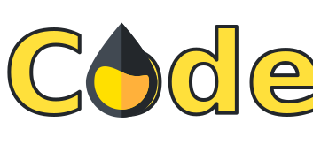

# Code 'N Design - Modelo de repositório para Design System

- [Demos & Docs](https://codendesign.web.app)
- [Storybook](https://codendesign-storybook.web.app/)
- [Playground](#) (_Em breve_)
- [Stack Blitz](#) (_Em breve_)

## Objetivos do projeto
- Melhorar experiência do desenvolvedor
- Compartilhar código entre bibliotecas
- Facilitar acesso entre código e design
- Diminuir tempo de builds e publicações
- Centralizar documentações para pacotes

### Objetivos pessoais
- Encontrar satisfação
- Aplicar conhecimento
- Manter-me aprendendo
- Validar conceitos...
- Atender projeto real

--

## Todo

---

This project was generated using [Nx](https://nx.dev).

*Nx is a set of Extensible Dev Tools for Monorepos.*

Visit the [Nx Documentation](https://nx.dev/angular) to learn more.

### Understand your workspace
Run `nx dep-graph` to see a diagram of the dependencies of your projects.

### ☁ Nx Cloud

### Computation Memoization in the Cloud

Nx Cloud pairs with Nx in order to enable you to build and test code more rapidly, by up to 10 times. Even teams that are new to Nx can connect to Nx Cloud and start saving time instantly.

Teams using Nx gain the advantage of building full-stack applications with their preferred framework alongside Nx’s advanced code generation and project dependency graph, plus a unified experience for both frontend and backend developers.

Visit [Nx Cloud](https://nx.app/) to learn more.
